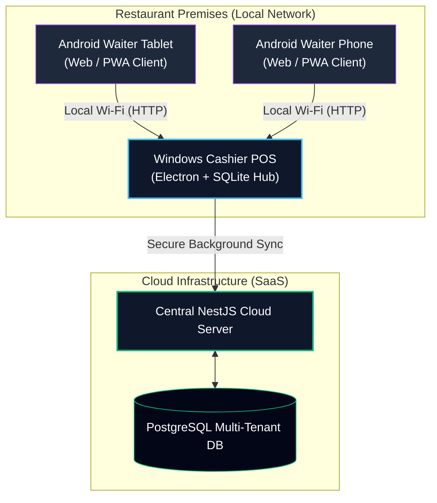
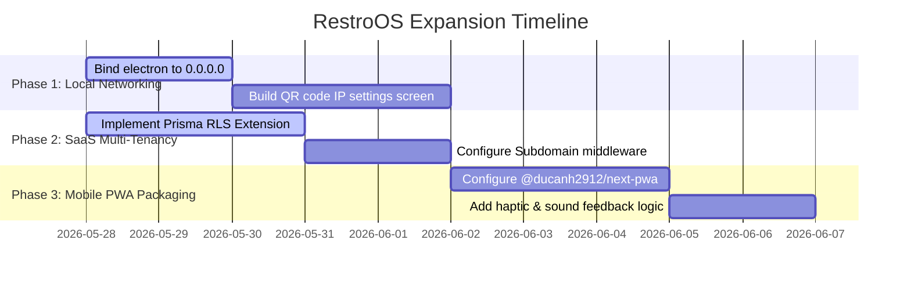

# RestroOS Master Architectural Blueprint: Connected Cross-Platform SaaS POS

This blueprint compiles the full technical strategy to scale **RestroOS** into a secure, multi-tenant SaaS POS platform that runs synchronously across **Windows desktop cashier registers** and **Android mobile/tablet waitstaff terminals**.

---

## 1. Unified Architecture Vision

RestroOS combines the best of two architectural worlds:
1. **Robust Local Terminals**: Offline-first, high-performance Windows applications running Next.js and SQLite locally on each register, immune to internet dropouts.
2. **Scalable SaaS Cloud Backend**: A central, multi-tenant NestJS backend connected to PostgreSQL, serving web-based mobile order clients and syncing desktop sales in the background.



---

## 2. Connected Cross-Platform Execution Plan

To get Android devices and Windows registers communicating seamlessly in a restaurant, we implement the **Local Hub & Spoke Wi-Fi** strategy, enhanced by **Progressive Web App (PWA)** capabilities.

### Step 2.1: Exposing the Local Windows Server
Currently, your local server binds only to the local loopback `localhost`. To allow Android devices on the restaurant's local Wi-Fi to load the app, update the listen parameters in `apps/pos/server-runner.js`:

```javascript
// apps/pos/server-runner.js (Update)
server.listen(PORT, '0.0.0.0', (err) => {
  if (err) {
    console.error('Server listen error:', err);
    process.exit(1);
  }
  console.log(`Next.js server programmatically listening on all interfaces at http://0.0.0.0:${PORT}`);
});
```
*Now, any waiter typing `http://<windows-pc-ip>:3002` into Chrome or Safari on their phone will instantly open the POS, querying and writing to the cashier PC's local SQLite database safely.*

### Step 2.2: Making the App Installable on Android (PWA)
By converting `@repo/pos` into an installable PWA, waitstaff get a native, borderless fullscreen UI with a custom launcher icon.

1. **Install PWA package**:
   ```bash
   npm install @ducanh2912/next-pwa --workspace=@repo/pos
   ```

2. **Configure PWA inside `apps/pos/next.config.ts`**:
   ```typescript
   import withPWA from '@ducanh2912/next-pwa';

   const pwaConfig = withPWA({
     dest: 'public',
     register: true,
     skipWaiting: true,
   });

   export default pwaConfig({
     reactStrictMode: true,
     // Keep your existing next config here
   });
   ```

---

## 3. Secure Multi-Tenant SaaS Foundation

To host multiple independent restaurants on a single database, your central cloud NestJS backend enforces **Logical Row-Level Data Isolation**.

### Step 3.1: Automatically Scoping Queries (Zero Data-Leak Driver)
To eliminate any risk of one restaurant seeing another’s sales, add this **Prisma Client Extension** in `packages/database/index.ts` to automatically scope every database operation by `tenantId` (your `restaurantId`).

```typescript
// packages/database/index.ts (Prisma Extension)
import { PrismaClient } from './generated/client';

export const getExtendedPrismaClient = (tenantId?: string) => {
  const prisma = new PrismaClient();

  if (!tenantId) return prisma;

  return prisma.$extends({
    query: {
      $allModels: {
        async $allOperations({ model, operation, args, query }) {
          // Bypass global tables like the Restaurant list itself or sync parameters
          const bypassModels = ['Restaurant', 'SyncMetadata'];
          if (bypassModels.includes(model)) {
            return query(args);
          }

          // 1. Force tenant binding on inserts
          if (operation === 'create' || operation === 'createMany') {
            args.data = {
              ...args.data,
              restaurantId: tenantId,
            };
          }

          // 2. Auto-inject tenant filter on reads, updates, and deletes
          if (['findFirst', 'findMany', 'update', 'updateMany', 'delete', 'deleteMany', 'count'].includes(operation)) {
            args.where = {
              ...args.where,
              restaurantId: tenantId,
            };
          }

          return query(args);
        },
      },
    },
  });
};
```
*With this in place, a query like `prisma.order.findMany()` automatically compiles down under-the-hood to `SELECT * FROM Order WHERE restaurantId = :tenantId`, keeping data fully sealed.*

---

## 4. Dual-Tenant Routing Architecture

We apply two separate tenant resolution strategies depending on whether requests come from online web clients or offline-first registers:

### Path A: Subdomain Extraction (SaaS Web App)
Online managers and web order clients are routed based on subdomains (e.g., `burgerjoint.restroos.com` or `pizzahouse.restroos.com`). Extract this in a NestJS global interceptor or middleware:

```typescript
// apps/server/src/auth/tenant.middleware.ts
import { Injectable, NestMiddleware } from '@nestjs/common';
import { Request, Response, NextFunction } from 'express';
import { PrismaService } from '../prisma.service';

@Injectable()
export class TenantMiddleware implements NestMiddleware {
  constructor(private prisma: PrismaService) {}

  async use(req: Request, res: Response, next: NextFunction) {
    const host = req.headers.host || ''; // e.g. "burgerjoint.restroos.com"
    const subdomain = host.split('.')[0];

    if (subdomain && subdomain !== 'www' && subdomain !== 'app') {
      const tenant = await this.prisma.restaurant.findUnique({
        where: { slug: subdomain },
      });
      
      if (tenant) {
        req['tenantId'] = tenant.id;
      }
    }
    next();
  }
}
```

### Path B: Header & License Validation (Desktop registers)
For the background POS terminal synchronization, your local machines send requests with strict authentication headers verified by [TenantGuard](file:///c:/Users/Sudesh/RSK%20New/apps/server/src/auth/tenant.guard.ts):

*   `x-tenant-id`: The restaurant's global UUID inside the cloud.
*   `x-license-key`: A cryptographically verifiable license validating their subscription tier.

---

## 5. Automated Onboarding Transaction (Cloud)

When a restaurant registers, spawn their database sandbox inside a single atomic transaction:

```typescript
// apps/server/src/restaurants/onboarding.service.ts
async function onboardTenant(name: string, slug: string) {
  return await prisma.$transaction(async (tx) => {
    // 1. Setup tenant profile
    const restaurant = await tx.restaurant.create({
      data: {
        name,
        slug,
        licenseKey: `RSTR-${Math.random().toString(36).substr(2, 9).toUpperCase()}`,
        settings: { taxRate: 5.0, currency: 'INR' }
      }
    });

    // 2. Initialize tenant's default admin user
    const user = await tx.user.create({
      data: {
        name: `${name} Owner`,
        username: `${slug}-admin`,
        role: 'ADMIN',
        restaurantId: restaurant.id
      }
    });

    // 3. Create default floor plans
    await tx.table.createMany({
      data: [
        { name: 'Table 1', capacity: 2, restaurantId: restaurant.id },
        { name: 'Table 2', capacity: 4, restaurantId: restaurant.id }
      ]
    });

    return { restaurant, user };
  });
}
```

---

## 6. Implementation Timeline Roadmap



---

> [!TIP]
> **To begin testing right now**:
> 1. Update [server-runner.js](file:///c:/Users/Sudesh/RSK%20New/apps/pos/server-runner.js) to bind to network interface `'0.0.0.0'`.
> 2. Boot up Electron locally using `npm run electron:dev`.
> 3. Connect your Android phone to the same Wi-Fi, look up your PC's IPv4 address via terminal (`ipconfig`), and navigate to `http://<your-pc-ip>:3002` in your mobile web browser to watch them run connected in real time!
